# Project Design – Moodies CLV Dashboard

This project is a react dashboard that shows insights and machine learning predictions for a Shopify store using data from Shopify and Klaviyo.

The project follows a Domain-Driven Design (DDD) structure, which means we split the project into separate layers, each with its own responsibility.

---

## Overview of Layers

### 1. **Interface Layer**
- This is the user facing layer, it dependes on the application layer to retrieve data, that is served to the user.
- Folder: `interfaces`
- The ui made with react lives in `interfaces\ui\mu-ui`.
- It shows pages like:
  - Overview
  - Customer Segments
  - CLV Analysis
  - Next Purchase Prediction
- It also handles user login.
- The REST API made with Flask lives in `interfaces\rest\v1`.
- It exposes multiple endpoint for the:
  - insights
  - Customer Segments
  - CLV Analysis
  - Next Purchase Prediction
- It also handles user login.

### 2. **Application Layer**
- Folder: `application/`
- This layer connects the interface with the domain & infra layer
- Each business logic living in the domain is represented with its own service. (e.g. insights_service.py serves insights data that is outputed by the domain logic to the interface layer)
- 
### 3. **Domain Layer**
- Folder: `domains/`
- This is the business core logic lays.
- It has 5 domains:
  
  #### a. `authentication/`
  - Authenticates users that log in.
  - Validates them against a users in an SQLite database.

  #### b. `insights/`
  - Cleans and processes data to generate insights.
  - Saves results in `resources/data/processed/`.

  #### c. `clv/`, `npd/`, `segment/`
  - Each domain:
    - Cleans and prepares its own data.
    - Engineers features and prepares data needed by the model.
    - Loads and train machine learning models.

### 4. **Infrastructure Layer**
- This layer is created to interface with external services.
- Folder: `infra/clients/`
- This layer fetches data from external APIs:
  - `klaviyo.py` fetches customer data
  - `shopify.py` fetches order data
- Data is saved to `resources/data/raw/`

---

## 📁 Data Folders

- `resources/data/raw/` → raw data from APIs
- `resources/data/processed/` → cleaned and feature-engineered data

## UML

### Process Flow diagram:

### Activity Diagram:

### Use case diagram

``` mermaid
flowchart TD
    user(["🧑 User Actor"]) --> login["Login to Dashboard"] & viewInsights["View Insights Page"] & clvPage["Use CLV Predictor"] & segmentPage["Use Customer Segmentation"] & npdPage["Use Next Purchase Date Predictor"] & refresh["Refresh Pipelines"]
    clvPage --> clvLeaderboard["View CLV Leaderboard"] & clvEmail["Search CLV by Email"]
    segmentPage --> segmentKPI["See Segment KPIs"] & segmentChart["View Segment Clusters"]
    npdPage --> timeline["See Next Purchase Timeline"] & table["See Prediction Table"]
    n1(["System Actor: Authentication system"]) --> n6[" "]
    n4(["System Actor: CLV model service"]) --> clvPage
    n8(["System Actor: Segment model service"]) --> segmentPage
    n10(["System Actor: NPD model service"]) --> npdPage
    n6@{ shape: anchor}
```

### Class Diagram

### Sequence Diagram

### State Diagram

